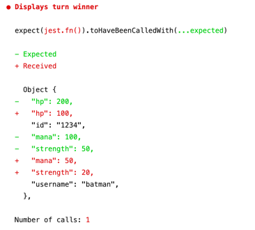
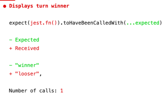

# Traceable

Object tagging for your tests

## Before



## After



### How to use

```typescript
import traceable from "jest-traceable"

test(`Displays turn winner`, () => {
	// Tag objects
	const winner = traceable(makeWinner(), "winner")
	const looser = traceable(makeLooser(), "looser")

	// Some code
	const ui = { notifyWinner: jest.fn() }
	const game = new Game(ui)

	game.turn(winner, looser)

	// Verify object passing
	expect(ui.notifyWinner).toHaveBeenCalledWith(winner)
})
```

[Full example](./src/demo.spec.ts)
